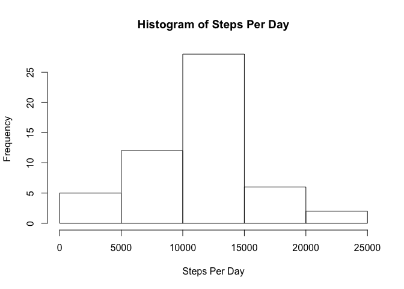
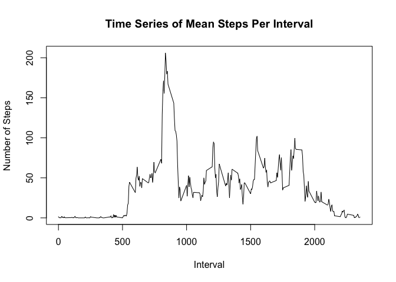
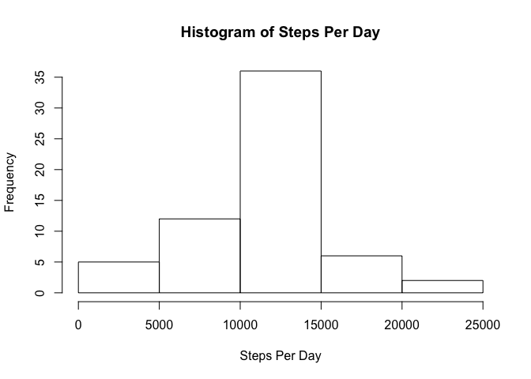
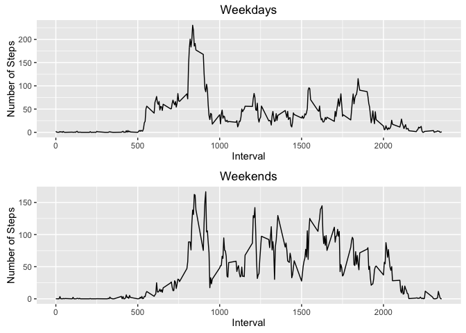

# Reproducible_Research_Project_1
asamuelson  
April 3, 2016  

1. Code for Loading and Preprocessing the Data


```r
ActivityData <- read.csv("activity.csv")
CompleteActivityData <- na.omit(ActivityData)
Intervals <- ActivityData$interval[1:288]
FilledData <- as.data.frame(ActivityData)
```

Compute Total Number of Steps Taken Per Day


```r
StepsPerDay <- tapply(ActivityData$steps, ActivityData$date, sum)
StepsPerInterval <- tapply(CompleteActivityData$steps, CompleteActivityData$interval, sum)
```

2. Histogram of Steps Per Day - Omitting Missing Values


```r
hist(StepsPerDay, xlab="Steps Per Day", main ="Histogram of Steps Per Day")
```



Code to Compute Mean and Median Number of Steps Taken Per Day Ignoring Missing Values


```r
MeanSteps <- mean(StepsPerDay, na.rm = TRUE)
MedianSteps <- median(StepsPerDay, na.rm = TRUE)
MeanStepsPerInterval <- tapply(CompleteActivityData$steps, CompleteActivityData$interval, mean)
```

3. Mean and Median Number of Steps Taken Per Day

Mean Steps Per Day: 10766.19

Median Steps Per Day: 10765

4. Time Series Plot of Mean Number of Steps Per Interval


```r
plot(Intervals, MeanStepsPerInterval, type="l", xlab="Interval", ylab="Number of Steps", main="Time Series of Mean Steps Per Interval")
```



Compute Interval with Maximum Number of Steps


```r
MaxSteps <- max(MeanStepsPerInterval)
MaxStepsPerInterval <- which(MeanStepsPerInterval == MaxSteps)
```

5. Interval 104 from 835 to 840 contains the maximum number of steps on average (206.17 steps).

6. Impute Missing Values - Replace the Missing Value with the Mean for the 5 minute Interval


```r
IncompleteData <- !complete.cases(ActivityData)
MissingCases <- sum(IncompleteData)
for (i in 1:nrow(FilledData)) {
    if (is.na(FilledData[i,]$steps)) {
        FilledData[i,]$steps <- MeanStepsPerInterval[Intervals == FilledData[i,]$interval]
    }
}
FilledStepsPerDay <- tapply(FilledData$steps, FilledData$date, sum)
FilledMeanSteps <- mean(FilledStepsPerDay)
FilledMedianSteps <- median(FilledStepsPerDay)
```

There are 2304 cases with missing values (i.e., cases with NAs)

7. Histogram of Steps Per Day - Imputing Missing Values


```r
hist(FilledStepsPerDay, xlab="Steps Per Day", main ="Histogram of Steps Per Day")
```



Mean Steps Per Day: 10766.19

Median Steps Per Day: 10766.19

The mean with imputed values is the same as the mean without imputed values.
However, the median is different and is now equal to the mean.

Compute Mean Steps Per Day for Weekdays and Weekends


```r
WeekDays <- factor(weekdays(as.Date(FilledData$date)) %in% c("Saturday","Sunday"), levels=c("FALSE","TRUE"), labels = c("Weekday","Weekend"))
WeekdaySteps <- subset(FilledData, WeekDays == "Weekday")
WeekendSteps <- subset(FilledData, WeekDays == "Weekend")
MeanStepsPerWeekend <- tapply(WeekendSteps$steps, WeekendSteps$interval, mean)
MeanStepsPerWeekday <- tapply(WeekdaySteps$steps, WeekdaySteps$interval, mean)
```

8. Plot Mean Steps Per Day for Weekdays and Weekends Using ggplot2


```r
library(ggplot2)
library(gridExtra)
```

```
## Warning: package 'gridExtra' was built under R version 3.2.4
```


```r
g1 <- ggplot(data=as.data.frame(MeanStepsPerWeekday), aes(Intervals,MeanStepsPerWeekday))
g2 <- ggplot(data=as.data.frame(MeanStepsPerWeekend), aes(Intervals,MeanStepsPerWeekend))
g1 <- g1 + geom_line() + xlab("Interval") + ylab("Number of Steps") + ggtitle("Weekdays")
g2 <- g2 + geom_line() + xlab("Interval") + ylab("Number of Steps") + ggtitle("Weekends")
g <- grid.arrange(g1, g2, ncol=1, nrow=2)
```


